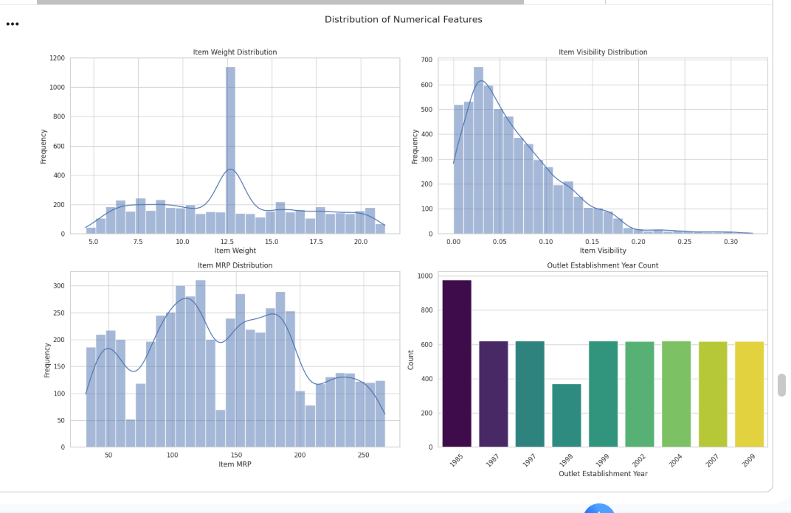
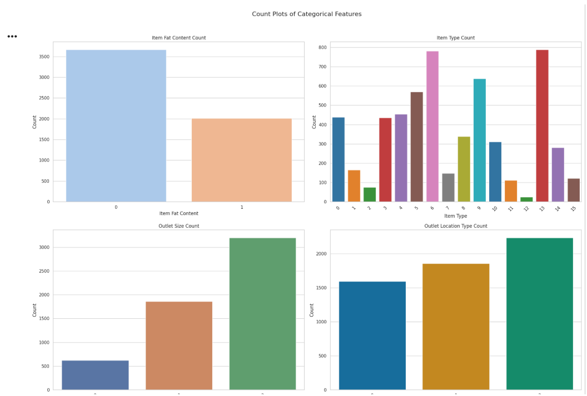

# Big Mart Sales Prediction Project

## Project Overview

This project aims to predict the Maximum Retail Price (Item_MRP) of products in Big Mart stores based on various item and outlet characteristics. The goal is to build a robust machine learning model that can accurately estimate product prices, which can be valuable for inventory management, pricing strategies, and sales forecasting.

## Dataset

The dataset used for this project is `big_mart_sales_data.csv`, containing detailed information about products sold in various Big Mart outlets. Key features include item weight, fat content, type, visibility, MRP, outlet details, and more.

## Methodology

1.  **Data Loading & Initial Exploration:** Inspection of data types, dimensions, and identification of missing values.
2.  **Data Preprocessing:** Handled missing `Item_Weight` (mean imputation) and `Outlet_Size` (mode imputation). Cleaned `Item_Fat_Content` categories and applied `LabelEncoding` to all categorical features.
3.  **Exploratory Data Analysis (EDA):** Visualized distributions of numerical features and counts of categorical features.
4.  **Model Training (XGBoost Regressor):** Trained an initial XGBoost model and established baseline performance.
5.  **Feature Importance:** Identified key features influencing `Item_MRP` predictions.
6.  **Hyperparameter Tuning:** Optimized the XGBoost model using `GridSearchCV` to enhance predictive accuracy.
7.  **Cross-Validation:** Performed K-Fold cross-validation to assess model robustness and generalization.
8.  **Error Analysis:** Examined residuals to understand model errors and identify potential areas for improvement.
9.  **Model Comparison:** Compared the tuned XGBoost model with a RandomForest Regressor.

## Key Findings & Results

### Model Performance

*   **Initial XGBoost Model:**
    *   Training R-squared: 0.8913
    *   Test R-squared: 0.6092
*   **Tuned XGBoost Model:**
    *   Training R-squared: 0.9924
    *   Test R-squared: 0.6709
    *   Mean Cross-Validation R-squared: 0.6812 (Std Dev: 0.0144)
*   **Random Forest Regressor:**
    *   Training R-squared: 0.9996
    *   Test R-squared: 0.6554

The hyperparameter-tuned XGBoost model achieved the best generalization performance with a Test R-squared of approximately 0.67-0.68.

### Feature Importance

The most important features for predicting `Item_MRP` were identified as `Item_Weight`, `Item_Type`, `Item_Identifier`, `Item_Fat_Content`, and `Item_Visibility`.

## Visualizations

Here are some key plots from the analysis:

### Distribution of Numerical Features

### Count Plots of Categorical Features

### Actual vs. Predicted Item MRP 

### Feature Importance

## Future Work

*   Further hyperparameter tuning for the Random Forest Regressor.
*   Exploring ensemble methods.
*   More advanced feature engineering based on error analysis insights.
*   Investigating outliers and specific segments of data where the model performs poorly.

## Technologies Used

*   Python
*   Pandas
*   NumPy
*   Matplotlib
*   Seaborn
*   Scikit-learn
*   XGBoost
